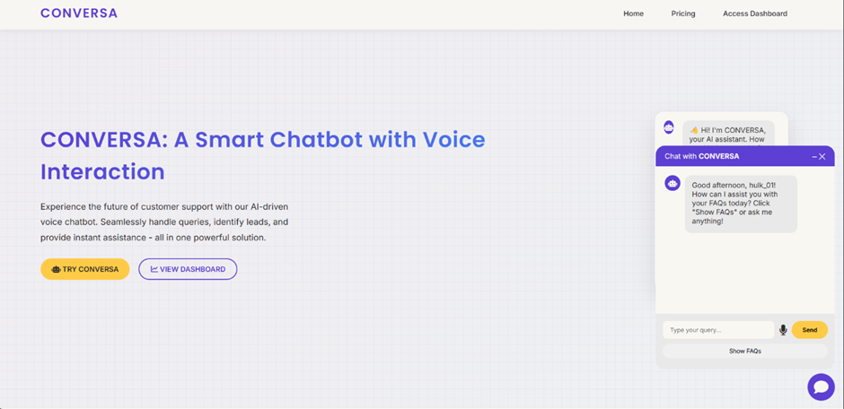

# CONVERSA | AI-Powered Chatbot Suite


## Table of Contents

- [Project Overview](#conversa--ai-powered-chatbot-suite)
- [Limitations of the Current System](#limitations-of-the-current-system)
- [Our Solution](#our-solution)
- [Technology Stack](#technology-stack)
- [Installation & Demo Setup](#installation--demo-setup)
- [Platform Walkthrough](#platform-walkthrough)
- [Future Improvements](#future-improvements)
- [Team](#team)

---

A project aimed at enhancing CONVERSA by integrating a suite of intelligent chatbots. These bots streamline repetitive tasks, foster seamless collaboration, and ensure better data management within Nextcloud Talk rooms.

---

## Limitations of the Current System

Nextcloud Talk is a powerful collaboration tool, but it lacks automation for routine tasks such as answering FAQs, reminding users of file expiries, boosting team morale, and cleaning up stale content.  
This project addresses these challenges by building **bots that integrate seamlessly with Nextcloud APIs**.

---

## Our Solution

We developed four intelligent bots that integrate with the **Nextcloud Talk Bot Framework** and **Files API** to automate key collaboration tasks.

### 1. FAQ Bot

A chatbot that answers frequently asked questions .

- Provides accurate responses to user queries
- Supports fuzzy matching for query variants
- _Additional Feature_: Admins can update FAQs directly from the Admin Panel

---

### 2. File Expiry Reminder Bot

Automatically reminds users when shared files are approaching their expiration date.

- Scans file shares via the **Nextcloud Files API**
- Posts reminders in relevant Talk rooms
- _Additional Feature_: Configurable reminder schedules (e.g., 7 days / 1 day before expiry)

---

### 3. Quote-of-the-Day Bot

Keeps teams engaged with daily motivational or fun quotes.

- Posts scheduled quotes to a designated Talk room
- Retrieves quotes from local files or external APIs
- _Additional Feature_: Users can contribute quotes via the `add quote` functionality.

---

### 4. Clean-up Bot

Maintains a clutter-free workspace by identifying and flagging stale content.

- Detects inactive rooms, outdated pinned messages, and stale files
- Generates and posts weekly cleanup reports in Talk
- _Additional Feature_: On-demand cleanup triggered via user commands

### Key Highlight of the Project

The FAQ Bot supports **voice-enabled interaction**, allowing users to ask questions through voice commands and receive both spoken and text-based responses from the chatbot.

---

## Technology Stack

### Core Application

- **Frontend:** HTML, CSS, JavaScript
- **Backend:** Python
- **Framework:** Django
- **Database:** SQLite (FAQs, Query Logs)

### Voice Capabilities

- **Speech-to-Text (STT):** Web Speech API (SpeechRecognition)
- **Text-to-Speech (TTS):** Web Speech API (SpeechSynthesis)

### APIs and External Services

- **WeatherStack API**
- **Date & Time APIs**

### Nextcloud Integration (React-based)

- **Frontend:** React with TailwindCSS / ShadCN for UI components
- **Framework:** Nextcloud App Framework (via APIs)
- **Backend Integration:** Nextcloud Talk API, Dashboard Widget API, Files API

### Security and Authentication

- **OAuth 2.0 / API key management** for external applications

### Real-Time Features

- **WebSockets / Server-Sent Events** for live chat and notifications

### Data Visualization & Analytics

- **Recharts, D3.js** for interactive charts and analytics widgets

---

## Installation & Demo Setup

Follow these steps to set up and run the project locally:

### Quick Start

```bash
git clone https://github.com/Nisarg0403/AI-Assistant.git && cd AI-Assistant && python -m venv venv && source venv/bin/activate && pip install -r requirements.txt && python manage.py migrate && python manage.py runserver
```

### 1. Clone the Repository

```bash
git clone https://github.com/Nisarg0403/AI-Assistant.git
```

### 2. Access the Folder

```bash
cd AI-Assistant
```

### 3. Create a Virtual Environment

```bash
python -m venv venv
source venv/bin/activate
```

### 4. Install Backend Dependencies

```bash
pip install -r requirements.txt
```

### 5. Apply Database Migrations

```bash
python manage.py migrate
```

### 6. Run the Django Development Server

```bash
python manage.py runserver
```

---

## Key Features

| Bot             | Functionality                   | Highlights                                  |
| --------------- | ------------------------------- | ------------------------------------------- |
| FAQ Bot         | Answer queries from markdown KB | Voice-enabled interaction, admin management |
| File Expiry Bot | Track shared files              | Configurable reminders, user notifications  |
| Quote Bot       | Daily motivational quotes       | Add custom quotes, dashboard integration    |
| Clean-Up Bot    | Archive old chats/files         | Weekly reports, on-demand cleanup           |

## Platform Walkthrough

### Homepage

  
The Homepage is the main interface where users can access and interact with the chatbot.

### Conversa Chat Dashboard

  
The Dashboard provides users with an overview of all chatbot activities, including file expiry alerts, cleanup bot actions, and daily quotes generated by the Quote-of-the-Day bot. It serves as the central hub to monitor and interact with the chatbot system.

### Admin Panel

  
The Admin Panel allows administrators to manage chatbot content, monitor activity, and configure bot settings.

### Manage FAQs

  
The Manage FAQs section enables admins to add, remove, and create custom FAQs along with their corresponding answer

### Quote-of-the-Day Bot

  
The Quote Bot allows users to generate new quotes that appear on the Dashboard. Users can also create and save custom quotes, which are displayed alongside the automated daily quotes, keeping teams engaged and motivated.

### File Expiry Alerts

  
This view shows files that are nearing expiration, along with their respective expiry dates. Users can quickly identify which files are at risk of deletion.

  
Users can create monitoring instances for specific files, specifying an expiry date. The bot will notify the relevant users when the monitored files approach their expiration.

### Clean-Up Bot

  
The Clean-Up Bot helps maintain a tidy workspace by archiving inactive chats and old files. Users can manage cleanup actions through this interface, while the Dashboard provides notifications about archived chat rooms and files, ensuring the workspace remains organized.

---

## API Endpoints

| Endpoint          | Method   | Description                      |
| ----------------- | -------- | -------------------------------- |
| /api/faq/         | GET/POST | Fetch or add FAQs                |
| /api/file-expiry/ | GET/POST | Monitor files approaching expiry |
| /api/quote/       | GET/POST | Add or retrieve quotes           |
| /api/cleanup/     | POST     | Trigger cleanup actions          |

---

## Future Improvements

- Web-based admin dashboard for real-time bot configuration
- Multi-language support for FAQs and Quotes
- AI-powered natural language responses for FAQs
- Integration with third-party APIs (e.g., compliance tools, external quotes)
- Enhanced analytics with dashboards for bot performance

---

## Team - Trouble Shooters

Developed during the National Level Open Source Online Hackathon, प्रज्ञा, by the team **Trouble Shooters**.

---

## License

This project is licensed under the MIT License.
